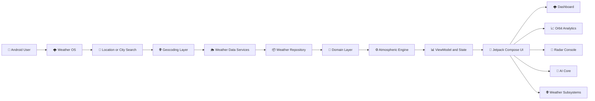
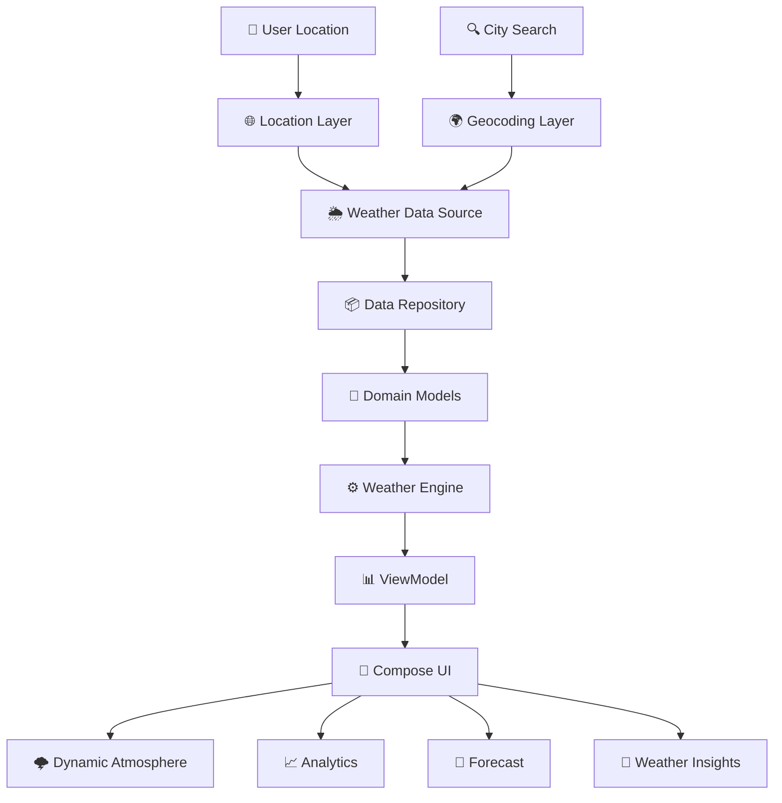
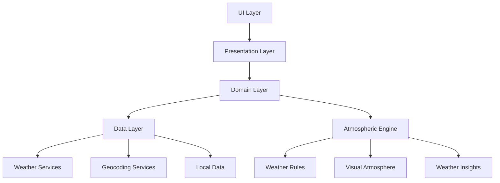

<div align="center">


<br><br>

# 🌩️ Weather OS

### Real-Time Weather Intelligence & Atmospheric Analytics

### Transforming Live Weather Data Into an Intelligent Atmospheric Experience

Experience location-aware weather intelligence powered by **Kotlin**, **Jetpack Compose**, modern weather data services, Android APIs, and a futuristic atmospheric visualization engine.

<br>

<a href="#">
    
</a>

<a href="https://github.com/sovanshit/Weather-OS">
    
</a>

<a href="#">
    
</a>

<br><br>


</div>

---

# 📱 Application Status

<div align="center">


</div>

---

# 📖 About

**Weather OS** is a native Android weather intelligence and atmospheric analytics application developed using **Kotlin** and **Jetpack Compose**.

Unlike traditional weather applications that simply display temperature and forecast cards, Weather OS explores the concept of a complete **Weather Operating System**.

The application combines location-aware weather information, atmospheric telemetry, hourly and multi-day forecasts, weather analytics, city comparison, air-quality visualization, radar architecture, intelligent weather insights, and dynamic weather-responsive environments within a futuristic mobile interface.

Weather OS follows a futuristic dark atmospheric design language featuring telemetry-inspired typography, glass-inspired components, animated rainfall, environmental particles, adaptive atmosphere rendering, interactive charts, and subsystem-style navigation.

The application follows **Clean Architecture** and **MVVM-based development principles**, separating data, domain, engine, presentation, and UI responsibilities for scalability and future expansion.

---

# 🎯 Objectives

- Build a modern native Android weather intelligence application.
- Integrate location-aware real-time weather information.
- Visualize atmospheric data through interactive dashboards.
- Develop a futuristic Weather Operating System interface.
- Explore weather analytics and environmental telemetry.
- Provide hourly and multi-day weather forecasts.
- Design contextual weather insights and advisory systems.
- Develop city-to-city atmospheric comparison.
- Explore radar and geographic weather visualization.
- Build an intelligent conversational weather assistant interface.
- Maintain scalable Android architecture.
- Create a responsive interface for different Android screen sizes.

---

# 🚀 Development Timeline

| Phase | Duration |
|---|---|
| Project Planning & Weather Research | April 2026 |
| Weather OS Concept Development | April 2026 |
| UI / UX Design & Prototyping | May 2026 |
| Android Architecture Planning | May 2026 |
| Kotlin & Jetpack Compose Development | May – June 2026 |
| Weather Data Integration | June 2026 |
| Atmospheric Dashboard Development | June 2026 |
| Forecast Analytics Development | June 2026 |
| Radar Console Architecture | June – July 2026 |
| Weather AI Core Interface | July 2026 |
| City Comparison & Globe Concepts | July 2026 |
| Testing & UI Optimization | July 2026 |
| Documentation & Repository Preparation | July 2026 |
| Future Public Release | Planned |

> 🌩️ Weather OS evolved from a weather dashboard concept into a larger atmospheric intelligence platform featuring telemetry, analytics, radar visualization, weather insights, city comparison, dynamic environments, and experimental intelligent weather modules.

---

# ✨ Key Features

<table>

<tr>

<td width="50%">

### 🌦️ Weather Intelligence

- Location-Based Weather
- Global City Search
- Current Weather Conditions
- Feels-Like Temperature
- Maximum & Minimum Temperature
- Hourly Forecast Timeline
- 7-Day Forecast
- Precipitation Analysis

</td>

<td width="50%">

### 🌐 Atmospheric Telemetry

- Humidity Monitoring
- Dew Point Information
- Wind Speed
- Wind Direction
- UV Index
- Sunrise & Sunset
- Air Quality Visualization
- Atmospheric Gauges

</td>

</tr>

<tr>

<td>

### 📊 Weather Analytics

- Temperature Curves
- Rain Probability Analysis
- Wind Analytics
- Humidity Analysis
- Forecast Charts
- Dual Temperature Trends
- Weather Insight Logs
- Predictive Visualization

</td>

<td>

### 🚀 Advanced Modules

- Weather Radar Console
- Radar Timeline Architecture
- AI Weather Core
- City Comparison
- Saved Places
- 3D Globe Concept
- Dynamic Atmosphere Engine
- Storm Runner Mini-Game

</td>

</tr>

</table>

---

# ⚙️ Tech Stack

<div align="center">


<br><br>

| Android | Architecture | Weather & Data | Tools |
|---|---|---|---|
| Kotlin | Clean Architecture | Weather APIs | Android Studio |
| Jetpack Compose | MVVM | Geocoding | Gradle |
| Material Design | Repository Pattern | Location Services | Git |
| Android SDK | State Management | Atmospheric Data | GitHub |
| Compose Canvas | Modular Layers | Air Quality Data | Kotlin DSL |

</div>

---

# 🚀 Weather OS Workflow



---

# 📂 Project Modules

| Module | Description |
|---|---|
| 🏠 Home | Main atmospheric weather dashboard and live condition interface. |
| 📊 Atmospheric Gauges | UV, humidity, wind, sunrise, sunset, and environmental telemetry. |
| 🧠 Weather Insight Logs | Contextual atmospheric observations and weather information. |
| 📅 Forecast System | Hourly and 7-day forecast visualization. |
| ⚠️ Warning System | Application-generated weather advisories and alerts. |
| 📈 Orbit Analysis | Temperature, rain, wind, and humidity analytics. |
| 📡 Radar Console | Experimental weather scan and radar visualization architecture. |
| 🧠 AI Core | Conversational weather intelligence interface. |
| 💙 Saved Places | Store and access preferred weather locations. |
| ⚖️ Compare Cities | Compare atmospheric conditions between locations. |
| 🌐 3D Globe | Experimental coordinate and geographic visualization concept. |
| ⚙️ Hardware Settings | Weather units, time format, sound, and rendering preferences. |
| 🎮 Storm Runner | Experimental weather-themed mini-game module. |

---

# 📸 Project Screenshots

A visual overview of the Weather OS atmospheric interface and primary weather intelligence modules.

---

# 🌩️ Real-Time Weather Intelligence Dashboard

The main Weather OS dashboard transforms location-based weather information into an immersive atmospheric environment.

It presents current conditions, location, temperature, feels-like values, daily maximum and minimum temperatures, contextual atmospheric information, and an hourly weather timeline.

Dynamic rainfall and environmental effects adapt the visual atmosphere to weather conditions.


## Dashboard Features

| Feature | Description |
|---|---|
| 📍 Location Weather | Displays weather for the selected or detected location |
| 🌡️ Current Temperature | Current atmospheric temperature |
| 🔥 Feels Like | Perceived weather temperature |
| 📈 Maximum Temperature | Daily maximum forecast |
| 📉 Minimum Temperature | Daily minimum forecast |
| ⏱️ Hourly Timeline | Hour-by-hour weather visualization |
| 🌧️ Dynamic Rain | Animated rain atmosphere |
| ⚡ Storm Environment | Weather-responsive storm visuals |
| 🧠 Atmospheric Summary | Contextual weather information |

---

# 🌡️ Atmospheric Gauges & Weather Insight System

The Atmospheric Gauges dashboard presents important environmental metrics through telemetry-inspired visual components.

Weather OS displays solar UV index, humidity, dew-point information, wind speed, wind heading, sunrise, and sunset information.

The Weather Insight Logs analyze current atmospheric values and display contextual observations such as active precipitation and elevated UV exposure.


## Atmospheric Gauge Features

| Feature | Description |
|---|---|
| ☀️ UV Index | Solar ultraviolet exposure monitoring |
| 💧 Humidity | Atmospheric moisture percentage |
| 🌫️ Dew Point | Atmospheric dew-point information |
| 💨 Wind Speed | Current wind velocity |
| 🧭 Wind Heading | Wind direction telemetry |
| 🌅 Sunrise | Daily sunrise information |
| 🌇 Sunset | Daily sunset information |
| 🌧️ Precipitation Insight | Contextual rainfall observation |
| ⚠️ UV Insight | High UV exposure information |

---

# 📅 7-Day Forecast & Predictive Weather Analytics

Weather OS provides a structured seven-day weather forecast with daily conditions, precipitation probability, maximum temperature, and minimum temperature.

The dashboard also includes a weather warning interface and dual-temperature predictive chart for visualizing weekly high and low temperature patterns.


## Forecast Analytics Features

| Feature | Description |
|---|---|
| 📅 7-Day Forecast | Multi-day weather outlook |
| 🌧️ Rain Probability | Daily precipitation probability |
| 🌡️ Maximum Temperature | Forecast high values |
| ❄️ Minimum Temperature | Forecast low values |
| ⚠️ Weather Notices | Application-generated advisories |
| 📈 Dual Temperature Chart | High and low temperature trends |
| 📊 Predictive Chart Logs | Visual forecast analytics |

> ⚠️ Application-generated weather insights should be treated as contextual information and not as a replacement for official emergency or government weather alerts.

---

# 📈 Meteorological Orbit Analysis

The Meteorological Orbit Analysis module transforms weather forecast data into interactive atmospheric analytics.

Users can explore separate analysis modes for **temperature**, **rain probability**, **wind**, and **humidity** through the telemetry navigation interface.


## Orbit Analysis Modes

| Analysis | Description |
|---|---|
| 🌡️ TEMP | Visualizes hourly temperature curves and forecast temperature changes |
| 🌧️ RAIN % | Analyzes precipitation probability across forecast periods |
| 💨 WIND | Displays wind speed and atmospheric movement trends |
| 💧 HUMID | Visualizes humidity patterns and moisture changes |

## Additional Features

- 12-hour atmospheric curves
- Multi-day climate tracks
- Forecast condition visualization
- Precipitation percentage
- Maximum and minimum temperature
- Interactive analysis modes
- Telemetry-inspired weather charts
- Diagnostic forecast presentation

---

# 📡 Orbit Weather Radar Console

The Orbit Weather Radar Console explores coordinate-based atmospheric scan visualization through a futuristic telemetry interface.

The module includes coordinate mapping, grid azimuth telemetry, scan signal information, storm-cell overlays, lightning visualization, radar intensity representation, frame timestamps, timeline navigation, playback controls, and adjustable animation rates.


## Radar Features

| Feature | Description |
|---|---|
| 🗺️ Coordinate Mapping | Geographic scan visualization |
| 🧭 Grid Azimuth | Radar orientation telemetry |
| 📡 Signal Telemetry | Scan signal information |
| ⚡ Lightning Overlay | Lightning visualization layer |
| 🌪️ Storm Cells | Atmospheric storm-cell overlays |
| 🌈 Radar Intensity | dBZ-inspired intensity visualization |
| ⏱️ Frame Timeline | Radar frame navigation |
| ▶️ Playback | Animated timeline controls |
| ⏭️ Frame Controls | Previous and next frame navigation |
| ⚙️ Speed Controls | Adjustable radar visualization speed |

> 🚧 **Experimental Module:** The radar console is currently under active improvement. Future development will focus on improved weather radar data integration, richer atmospheric overlays, more accurate visualization, smoother playback, and advanced real-time scan architecture.

---

# 🧠 Neural Intelligence Core

Weather OS includes an advanced conversational weather intelligence interface designed to analyze atmospheric context and assist users with weather-related questions.

The AI Core architecture is designed for questions about rainfall, forecasts, cricket suitability, outdoor activity conditions, and weather-aware clothing recommendations.


## AI Core Capabilities

| Capability | Description |
|---|---|
| 🌧️ Rain Queries | Analyze rainfall and forecast context |
| 🏏 Cricket Suitability | Evaluate weather conditions for cricket activities |
| 👕 Clothing Suggestions | Weather-aware clothing recommendations |
| 🚶 Outdoor Activities | Analyze outdoor weather suitability |
| 🌦️ Forecast Questions | Contextual forecast assistance |
| ⚡ Smart Queries | Pre-configured weather prompts |
| 💬 Conversational UI | Weather-focused assistant interface |
| 🧠 Context Analysis | Atmospheric context interpretation |

> 🚀 The Neural Intelligence Core is an evolving weather assistance layer. Future development will focus on deeper contextual reasoning, improved weather-data grounding, enhanced conversational capabilities, and more advanced weather intelligence.

---

# ⚙️ Hardware Telemetry Preferences

The Hardware Telemetry Preferences module allows users to configure Weather OS according to their measurement and atmospheric experience preferences.


## Preference Controls

| Setting | Options |
|---|---|
| 🌡️ Temperature Units | Celsius / Fahrenheit |
| 💨 Wind Speed Metrics | Metric / Imperial |
| 🕐 Time Format | System / 12-Hour / 24-Hour |
| 🌧️ Ambient Nature Sounds | Enable or disable environmental audio |
| 🌐 Automatic Atmosphere Engine | Match visual environment to live weather |
| 🎨 Render Quality | Eco / Balanced / High |

The adaptive atmosphere system is designed to change background visuals and environmental effects according to weather conditions.

---

# 🛰️ Space Deck Commands

Space Deck Commands acts as the subsystem control center of Weather OS.

It provides access to additional weather tools, experimental atmospheric modules, saved locations, comparison systems, hardware preferences, and application specifications.


## Available Subsystems

| Subsystem | Purpose |
|---|---|
| 💙 Saved Places | Access stored weather locations |
| ↔️ Compare Cities | Compare weather between locations |
| 🌐 3D Globe Concept | Explore geographic visualization |
| 🎮 Storm Runner Game | Launch the weather mini-game |
| ⚙️ Hardware Settings | Configure Weather OS preferences |
| 🖥️ Build Specifications | View application technology information |

---

# ⚖️ Dual Weather Comparer

The Dual Weather Comparer allows atmospheric conditions between two selected locations to be analyzed side by side.

The architecture is designed to support Indian cities and searchable weather locations available through the application's weather and geocoding data layer.


## Comparison Metrics

- 🌡️ Current temperature
- 🌦️ Weather conditions
- 💧 Humidity
- 💨 Wind speed
- 🌫️ Air Quality Index
- 📊 Comparative weather analysis

The Comparative Core Logs generate contextual observations such as identifying the colder location or comparing air-quality conditions.

> 🇮🇳 Weather OS is designed to support weather searches and comparison across Indian cities where valid location and weather data are available from the configured data services.

---

# 🌐 3D Coordinates Globe

The 3D Coordinates Globe is an experimental atmospheric visualization module designed to explore geographic and meteorological concepts through an interactive orbital-style interface.


## Globe Features

- 🌐 Interactive globe concept
- 🖱️ Drag-to-rotate interaction architecture
- 📍 Spatial coordinate markers
- 🛰️ Satellite position logs
- 🔄 Orbital rotation telemetry
- 🧭 Polar axis information
- 🌦️ Meteorological grid visualization

> 🧪 **Work in Progress:** The 3D globe is not yet considered a complete geographic visualization system. Future improvements are planned for smoother interaction, advanced rendering, richer geographic information, location markers, and deeper atmospheric data visualization.

---

# 🌧️ Dynamic Atmosphere Engine

Weather OS includes a dynamic atmospheric rendering system designed to visually respond to current weather conditions.

The interface can display rainfall, atmospheric particles, storm environments, and weather-responsive backgrounds.

## Atmosphere Features

| Weather Condition | Visual Environment |
|---|---|
| ☀️ Clear | Clean atmospheric environment |
| ☁️ Cloudy | Dark cloud-inspired atmosphere |
| 🌧️ Rain | Animated rainfall |
| ⛈️ Thunderstorm | Rain and storm environment |
| 🌫️ Fog | Reduced-visibility atmospheric styling |
| 🌙 Night | Dark nighttime environment |

The automatic atmosphere engine can adapt visual effects according to live weather conditions.

---

# 🎮 Storm Runner Mini-Game

Weather OS explores weather-themed interaction through the **Storm Runner** mini-game module.

The module is designed as an optional entertainment subsystem and remains separate from core weather data processing.

## Game Concept

- Weather-inspired environment
- Storm-themed gameplay
- Lightweight module architecture
- Separate from weather analytics
- Designed for future expansion

> 🎮 Storm Runner is an experimental module and may evolve through future Weather OS releases.

---

# 🌐 Weather Data Architecture

Weather OS is designed around a modular weather data pipeline.



---

# 🏗️ Clean Architecture

Weather OS follows a modular architecture inspired by Clean Architecture and MVVM principles.



---

# 📂 Project Structure

```text
📦 Weather OS
│
├── 📂 app
│   └── 📂 src
│       └── 📂 main
│           │
│           ├── 📂 java
│           │   └── 📂 weatheros
│           │       │
│           │       ├── 📂 data
│           │       ├── 📂 domain
│           │       ├── 📂 engine
│           │       ├── 📂 presentation
│           │       ├── 📂 ui
│           │       └── MainActivity.kt
│           │
│           ├── 📂 res
│           │   ├── drawable
│           │   ├── mipmap
│           │   ├── values
│           │   └── xml
│           │
│           └── AndroidManifest.xml
│
├── 📂 assets
├── 📂 gradle
├── 📂 screenshots
│
├── 📜 build.gradle.kts
├── 📜 settings.gradle.kts
├── 📜 gradle.properties
├── 📜 metadata.json
├── 📜 .env.example
└── 📜 README.md
```

---

# 📁 Layer Description

| Layer | Description |
|---|---|
| 📂 data | Weather data sources, repositories, network models, and data mapping |
| 📂 domain | Core weather models and application use cases |
| 📂 engine | Atmospheric logic, weather insights, and environmental systems |
| 📂 presentation | ViewModels and application state management |
| 📂 ui | Jetpack Compose screens, components, navigation, and themes |
| 📜 MainActivity.kt | Main Android application entry point |

> 📌 The modular structure helps keep weather data, atmospheric logic, application state, and Compose UI responsibilities separated for future scalability.

---

# 🚀 Installation

Follow these steps to run **Weather OS** locally.

---

## 1️⃣ Clone the Repository

```bash
git clone https://github.com/sovanshit/Weather-OS.git
```

---

## 2️⃣ Open Android Studio

Launch Android Studio and select:

```text
Open
```

Select the cloned **Weather OS** project folder.

---

## 3️⃣ Sync Gradle

Allow Android Studio to download and synchronize all required Gradle dependencies.

You can also select:

```text
File → Sync Project with Gradle Files
```

---

## 4️⃣ Configure Environment

Copy:

```text
.env.example
```

Create your required local environment configuration according to the enabled weather services.

> ⚠️ Never commit private API credentials or secret configuration values to a public GitHub repository.

---

## 5️⃣ Select Android Device

Use either:

- 📱 Physical Android device
- 🤖 Android Studio Emulator

For a physical device, enable:

```text
Developer Options
USB Debugging
```

---

## 6️⃣ Run Weather OS

Click the Android Studio:

```text
▶ Run
```

Or use the available Gradle build configuration.

---

# 📦 Build Debug APK

On Windows:

```bash
gradlew.bat assembleDebug
```

On macOS or Linux:

```bash
./gradlew assembleDebug
```

The generated APK is normally available inside:

```text
app/build/outputs/apk/debug/
```

---

# 🚀 Build Release Version

```bash
gradlew.bat assembleRelease
```

A signed production release requires Android signing configuration.

> 🔐 Keep signing keys, passwords, and production secrets outside the public repository.

---

# 🔐 Permissions & Privacy

Weather OS is designed to request only permissions required by enabled application features.

## Permission Considerations

| Permission | Purpose |
|---|---|
| 🌐 Internet | Retrieve weather and atmospheric data |
| 📍 Location | Detect local weather conditions |
| 🔔 Notifications | Future weather notification support |
| 🔊 Audio | Optional ambient weather sound features |

Location access should only be used for weather retrieval after user permission is granted.

---

# 🛡️ Weather Information Disclaimer

Weather OS is an educational, research, and portfolio project exploring weather data visualization and atmospheric intelligence.

Application-generated weather insights and advisories should not replace official warnings from government agencies, meteorological departments, or emergency authorities.

For severe weather emergencies, always follow official local safety instructions.

---

# 📈 Future Roadmap

| Feature | Status |
|---|:---:|
| 🌦️ Improved Live Weather Integration | 🚧 Improving |
| 📡 Advanced Radar Data Integration | 🚧 Planned |
| ⚡ Enhanced Lightning Visualization | 🚧 Planned |
| 🌪️ Advanced Storm Cell Tracking | 🚧 Planned |
| 🌐 Improved 3D Weather Globe | 🚧 Planned |
| 🧠 Advanced Weather Intelligence | 🚧 Planned |
| 🏏 Cricket Weather Analysis | 🚧 Planned |
| 👕 Smart Clothing Recommendations | 🚧 Planned |
| 🌫️ Expanded Air Quality Analytics | 🚧 Planned |
| 🔔 Weather Notifications | 🚧 Planned |
| 📍 Improved Saved Locations | 🚧 Planned |
| 🌍 Expanded Location Support | 🚧 Planned |
| 📊 Advanced Weather Charts | 🚧 Planned |
| 🛰️ Satellite Visualization | 🧪 Research |
| 🌧️ Improved Atmosphere Effects | 🚧 Planned |
| 🎮 Storm Runner Expansion | 🚧 Planned |
| 📱 Tablet Optimization | 🚧 Planned |
| ⌚ Wear OS Exploration | 🧪 Research |

---

# 🧪 Experimental Modules

Some Weather OS modules are exploratory concepts and remain under active development.

| Module | Development State |
|---|---|
| 📡 Radar Console | Experimental / Improving |
| 🌐 3D Coordinates Globe | Experimental |
| 🧠 Neural Intelligence Core | Evolving |
| 🎮 Storm Runner | Experimental |
| 🛰️ Satellite Telemetry | Concept |
| 🌪️ Storm Tracking | Future Improvement |

The goal of these modules is to explore future atmospheric visualization and intelligent weather interaction concepts.

---

# 📊 Project Statistics

| Metric | Value |
|---|---:|
| 📱 Platform | Android |
| 💻 Primary Language | Kotlin |
| 🎨 UI Framework | Jetpack Compose |
| 🏗️ Architecture | MVVM / Clean Architecture |
| 🌦️ Weather Modules | Multiple |
| 📊 Analytics Modes | 4+ |
| 📡 Radar Module | Included |
| 🧠 Weather AI Interface | Included |
| 🌐 Globe Concept | Included |
| ⚙️ Preference System | Included |
| 📱 Responsive Android UI | Yes |
| 🌙 Dark Atmospheric Theme | Yes |
| 🌧️ Dynamic Weather Effects | Yes |

---

# ⚡ Performance Highlights

| Feature | Status |
|---|:---:|
| Native Android Application | ✅ |
| Jetpack Compose UI | ✅ |
| Kotlin Development | ✅ |
| Modular Architecture | ✅ |
| Dynamic Weather UI | ✅ |
| Interactive Charts | ✅ |
| Responsive Android Layout | ✅ |
| Atmospheric Animations | ✅ |
| Weather State Management | ✅ |
| Scalable Architecture | ✅ |

---

# 📱 Android Compatibility

Weather OS is designed as a native Android application.

| Device | Support |
|---|:---:|
| 📱 Android Phones | ✅ |
| 📱 Large Android Phones | ✅ |
| 📲 Foldable Layout Research | 🚧 |
| 📟 Android Tablets | 🚧 Improving |
| ⌚ Wear OS | 🧪 Future Research |

Responsive Compose layouts and adaptive interface improvements remain part of continued development.

---

# 💡 Why Weather OS?

Weather OS explores a different approach to weather applications.

Instead of displaying weather information as a collection of simple cards, the project treats atmospheric data as an interactive operating environment.

Weather information is organized into dashboards, telemetry systems, analytics modules, radar consoles, atmospheric engines, and intelligent subsystems.

The project combines:

- 🌦️ Weather data
- 📊 Atmospheric analytics
- 📡 Radar concepts
- 🧠 Weather intelligence
- 🌐 Geographic visualization
- 🌧️ Dynamic environments
- 🎨 Futuristic Android UI
- ⚙️ Modern Android architecture

Weather OS demonstrates how modern Android technologies can transform weather information into an immersive atmospheric experience.

---

# 🤝 Contributing

Contributions, suggestions, and technical feedback are welcome.

Whether it is improving the Android architecture, optimizing Compose performance, expanding weather analytics, improving radar visualization, or suggesting new atmospheric modules, contributions can help Weather OS evolve.

---

## Contribution Workflow

```text
Fork Repository
        │
        ▼
Create Feature Branch
        │
        ▼
Develop Feature
        │
        ▼
Test Changes
        │
        ▼
Commit Changes
        │
        ▼
Push Branch
        │
        ▼
Open Pull Request
```

---

# 👨‍💻 Developer

<div align="center">

## Sovan Shit

### Frontend Developer • Android & AI Project Developer

Building modern interactive applications and exploring intelligent user experiences through web, Android, AI, and emerging technologies.

</div>

---

## 🛠️ Project Responsibilities

- 🎨 Weather OS UI / UX Design
- 📱 Android Application Development
- 🟣 Kotlin Development
- 🚀 Jetpack Compose Interface
- 🌦️ Weather Data Integration
- 📍 Location Weather Architecture
- 📊 Weather Analytics Interface
- 📡 Radar Console Development
- 🧠 Weather Intelligence Interface
- 🌐 3D Globe Concept Development
- 🌧️ Dynamic Atmosphere Engine
- ⚙️ Preference System
- 🏗️ MVVM Architecture
- 🧱 Clean Architecture Structure
- 📱 Responsive Android Design
- ⚡ Performance Optimization
- 🧪 Experimental Module Research

---

# 🏆 Project Highlights

- 🌩️ Futuristic Weather Operating System Concept
- 📱 Native Android Application
- 🟣 Kotlin Development
- 🚀 Jetpack Compose UI
- 🌦️ Location-Based Weather
- 🌍 City Weather Search
- 📅 Hourly Weather Timeline
- 📆 7-Day Forecast
- 🌧️ Precipitation Analytics
- 💧 Humidity Monitoring
- 💨 Wind Telemetry
- ☀️ UV Index Visualization
- 🌅 Sunrise & Sunset Information
- ⚠️ Weather Insight System
- 📊 Interactive Weather Charts
- 📈 Meteorological Orbit Analysis
- 📡 Weather Radar Console
- 🧠 Neural Intelligence Core
- ⚖️ Dual Weather Comparer
- 🇮🇳 Indian City Weather Architecture
- 🌐 3D Coordinates Globe Concept
- 🌧️ Dynamic Rain Animation
- ✨ Environmental Particle Effects
- ⚙️ Hardware Telemetry Preferences
- 🎮 Storm Runner Mini-Game
- 🏗️ Clean Architecture
- 📊 MVVM-Based Structure
- 🌙 Futuristic Dark Atmospheric UI

---

# 🙏 Acknowledgements

Special thanks to the technologies, developer communities, weather data platforms, and open-source projects that support modern Android and weather application development.

- Android
- Kotlin
- Jetpack Compose
- Android Studio
- Gradle
- Open Weather Data Communities
- Open Geospatial Technologies
- Material Design
- Git
- GitHub
- Open Source Community ❤️

---

# 📄 License

This project is developed for **educational, research, experimentation, and portfolio purposes**.

You are welcome to explore the project structure and learn from its implementation.

Please provide appropriate credit when referencing substantial project concepts or implementation ideas.

---

# 🚀 Public Release

The public release of **Weather OS** is planned for the future.

Development is continuing across weather intelligence, atmospheric analytics, radar visualization, intelligent assistance, and advanced environmental rendering.

<div align="center">

<a href="#">


</a>

</div>

---

# ⭐ Repository Statistics

<div align="center">


</div>

---

# 💙 Support Weather OS

If you find **Weather OS** interesting, consider supporting the project.

⭐ Star the repository

🍴 Fork the project

🐞 Report bugs

🌦️ Suggest weather features

📡 Share radar visualization ideas

🧠 Suggest weather intelligence improvements

🤝 Contribute to development

Every contribution, suggestion, and star supports the continued development of Weather OS.

---

<div align="center">

# 🌩️ Thank You for Visiting Weather OS

### Building a Futuristic Atmospheric Intelligence Experience

### Weather • Analytics • Radar • Intelligence • Android

Made with ❤️ by **Sovan Shit**

</div>
