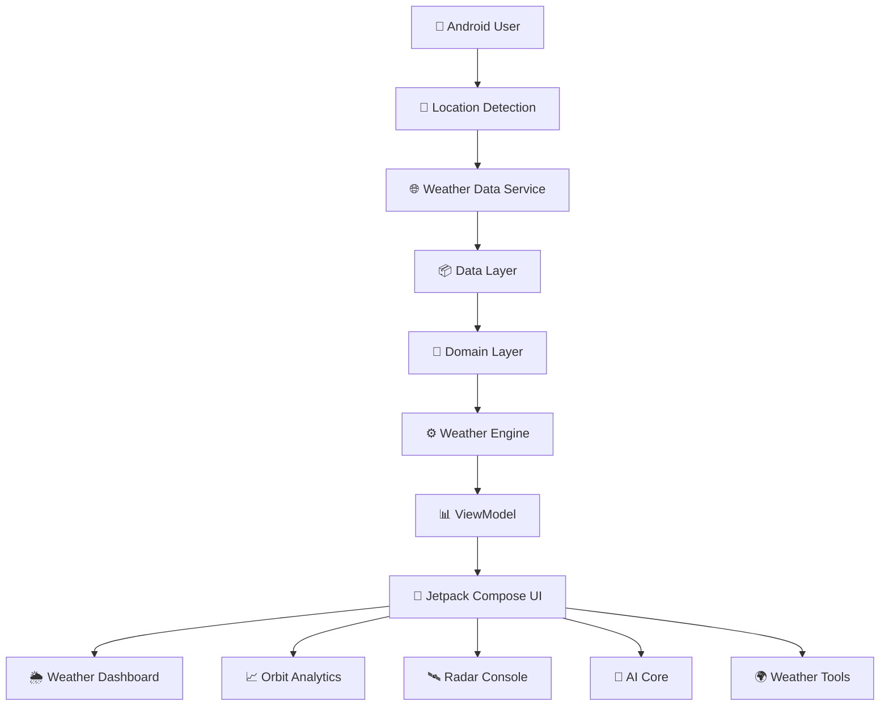
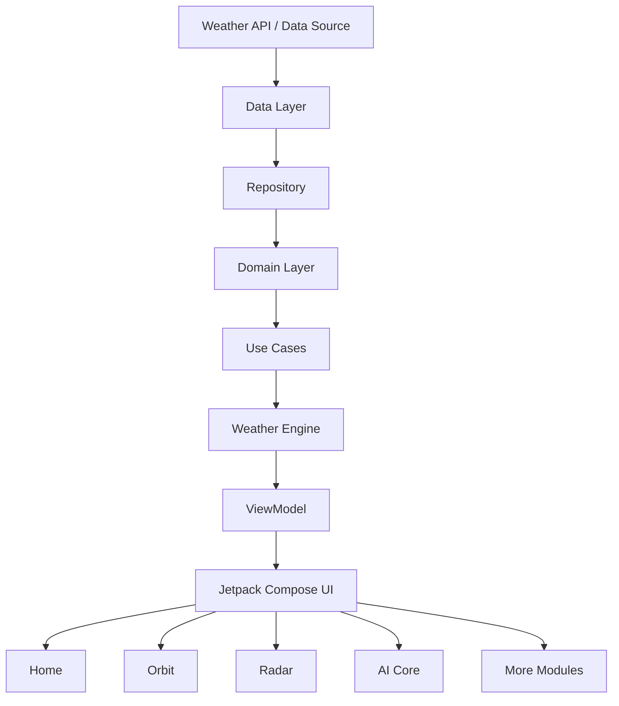
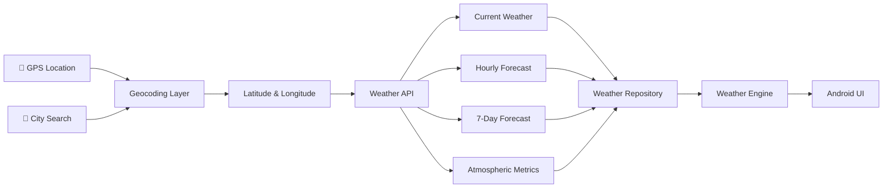

<div align="center">


<br><br>

# 🌩️ Weather OS

### Native Android Weather Intelligence & Atmospheric Analytics Platform

### Real-Time Weather • Atmospheric Analytics • Radar • AI Weather Intelligence

Weather OS is a futuristic Android weather intelligence application built with **Kotlin**, **Jetpack Compose**, **Clean Architecture**, and modern weather data services.

<br>

<a href="#">
    
</a>

<a href="https://github.com/sovanshit/Weather-OS">
    
</a>

<br><br>


</div>

---

# 📖 About Weather OS

**Weather OS** is a native Android weather intelligence and atmospheric analytics application developed using **Kotlin and Jetpack Compose**.

The application provides location-based current weather, hourly and 7-day forecasts, atmospheric metrics, weather insights, city comparison, radar visualization, weather analytics, air-quality information, configurable units, dynamic weather visuals, and a conversational weather assistant interface.

The project follows a futuristic **Weather Operating System** design language with a dark atmospheric interface, glass-inspired components, animated rain and particle effects, adaptive weather environments, interactive charts, and a telemetry-style dashboard.

Weather OS follows **Clean Architecture and MVVM principles**, separating data, domain, engine, presentation, and UI layers for improved scalability and maintainability.

---

# 🎯 Project Objectives

- Build a modern native Android weather intelligence platform.
- Display real-time location-based weather information.
- Visualize atmospheric and forecast data.
- Explore futuristic weather UI and UX concepts.
- Develop interactive weather analytics.
- Implement location and city-based weather discovery.
- Build an intelligent weather assistant architecture.
- Explore interactive radar and globe visualization.
- Maintain a modular and scalable Android architecture.

---

# ✨ Key Features

<table>

<tr>

<td width="50%">

### 🌦️ Weather Intelligence

- Real-Time Weather
- Current Temperature
- Feels-Like Conditions
- Maximum & Minimum Temperature
- Hourly Forecast
- 7-Day Forecast
- Rain Probability
- Weather Advisories

</td>

<td width="50%">

### 🌍 Atmospheric Analytics

- Humidity Monitoring
- Dew Point
- Wind Telemetry
- UV Index
- Sunrise & Sunset
- Air Quality
- Forecast Analytics
- Temperature Trends

</td>

</tr>

<tr>

<td>

### 🛰️ Advanced Modules

- Weather Radar Console
- Radar Timeline
- City Comparison
- Saved Places
- 3D Globe Concept
- AI Weather Core
- Storm Runner Module

</td>

<td>

### ⚙️ Platform Features

- Kotlin
- Jetpack Compose
- MVVM
- Clean Architecture
- Dynamic Atmosphere Engine
- Adaptive Rendering
- Unit Preferences
- Responsive Android UI

</td>

</tr>

</table>

---

# ⚙️ Tech Stack

<div align="center">


<br><br>

| Category | Technology |
|----------|------------|
| Language | Kotlin |
| UI | Jetpack Compose |
| Architecture | MVVM |
| Project Architecture | Clean Architecture |
| Networking | REST Weather APIs |
| Async Processing | Kotlin Coroutines |
| State Management | Compose State / ViewModel |
| Build System | Gradle Kotlin DSL |
| Development | Android Studio |
| Version Control | Git & GitHub |

</div>

---

# 🚀 Application Workflow



---

# 📂 Core Application Modules

| Module | Description |
|---------|-------------|
| ☁️ Home | Main weather intelligence and forecast dashboard |
| 📈 Orbit | Atmospheric analysis and predictive weather charts |
| 🛰️ Radar | Interactive weather radar console architecture |
| 🤖 AI Core | Conversational weather intelligence interface |
| 🌍 More | Advanced weather tools and system modules |
| ❤️ Saved Places | Manage frequently monitored locations |
| 🔄 Compare Cities | Compare weather telemetry between locations |
| 🌐 3D Globe | Experimental coordinate-based weather globe |
| ⚙️ Settings | Configure weather units and atmosphere preferences |
| 🎮 Storm Runner | Weather-themed mini-game module |

---

# 📸 Project Screenshots

The following screenshots demonstrate the primary **Weather OS atmospheric intelligence, analytics, radar, AI, and visualization modules**.

> 📱 Screenshots are displayed in a compact mobile format for a clean GitHub documentation experience.

---

# 🌩️ Weather OS Dashboard

The main Weather OS dashboard provides location-based current weather, live temperature, feels-like conditions, minimum and maximum temperatures, weather advisories, atmospheric reports, and hourly forecast telemetry.

<div align="center">


<br>

<sub>🌦️ Live Weather • ⚠️ Alerts • 🤖 Atmospheric Insights • ⏱️ Hourly Forecast</sub>

</div>

### Dashboard Features

| Feature | Description |
|---------|-------------|
| 📍 Location Weather | Displays weather for the active location |
| 🌡️ Temperature | Current atmospheric temperature |
| 🌡️ Feels Like | Perceived temperature conditions |
| 🔺 Maximum Temperature | Forecast maximum temperature |
| 🔻 Minimum Temperature | Forecast minimum temperature |
| ⚠️ Weather Advisory | Severe weather warning interface |
| 🤖 AI Report | Atmospheric weather insight summary |
| ⏱️ Hourly Timeline | Upcoming hourly weather conditions |

---

# 🌡️ Atmospheric Gauges & Weather Insights

Weather OS visualizes essential atmospheric telemetry using modern gauges, weather cards, and contextual insight panels.

<div align="center">


<br>

<sub>☀️ UV • 💧 Humidity • 🌬️ Wind • 🌅 Solar Orbit • 🤖 Weather Insights</sub>

</div>

### Atmospheric Metrics

| Feature | Description |
|---------|-------------|
| ☀️ UV Index | Solar UV exposure monitoring |
| 💧 Humidity | Atmospheric humidity percentage |
| 💦 Dew Point | Atmospheric moisture information |
| 🌬️ Wind Speed | Wind speed telemetry |
| 🧭 Wind Heading | Wind directional information |
| 🌅 Sunrise | Daily sunrise information |
| 🌇 Sunset | Daily sunset information |
| 🌧️ Precipitation Insight | Contextual rainfall observation |
| ⚠️ UV Insight | High UV exposure advisory |

---

# ⚠️ Weather Warning & Predictive Analytics

Weather OS combines structured forecast information with severe weather advisories and predictive temperature visualization.

<div align="center">


<br>

<sub>🗓️ Forecast • ⚠️ Severe Alerts • 📈 Predictive Weather Analytics</sub>

</div>

### Forecast Analytics Features

| Feature | Description |
|---------|-------------|
| 🗓️ 7-Day Forecast | Daily weather conditions and forecast data |
| 🌧️ Rain Probability | Daily precipitation probability |
| 🌡️ Temperature Range | Maximum and minimum temperature tracking |
| ⚠️ Weather Alerts | Severe weather and thunderstorm advisories |
| 📈 Predictive Analytics | Weekly temperature trend visualization |
| 🔴 Maximum Temperature | High-temperature trend analysis |
| 🔵 Minimum Temperature | Low-temperature trend analysis |

---

# 📈 Meteorological Orbit Analysis

The Meteorological Orbit Analysis module provides interactive atmospheric data visualization for **temperature, rain percentage, wind, and humidity**.

<div align="center">


<br>

<sub>🌡️ Temperature • 🌧️ Rain • 🌬️ Wind • 💧 Humidity • 📈 Climate Tracks</sub>

</div>

### Orbit Analytics Features

| Feature | Description |
|---------|-------------|
| 🌡️ TEMP | Temperature trend analysis |
| 🌧️ RAIN % | Rain probability analytics |
| 🌬️ WIND | Wind telemetry visualization |
| 💧 HUMID | Humidity trend analysis |
| 📈 12-Hour Curve | Hourly atmospheric trend chart |
| 🗓️ Climate Tracks | Structured 7-day forecast tracking |
| ⚡ Diagnostic Logs | Weather condition analysis architecture |

---

# 🛰️ Orbit Weather Radar Console

The Orbit Weather Radar Console explores coordinate-based weather scan mapping and atmospheric event visualization.

<div align="center">


<br>

<sub>📡 Radar Telemetry • ⚡ Lightning • 🌩️ Storm Cells • ▶️ Timeline Playback</sub>

</div>

### Radar Console Features

| Feature | Description |
|---------|-------------|
| 🧭 Grid Azimuth | Radar scan orientation telemetry |
| 📡 Signal Strength | Radar interface signal telemetry |
| 📍 Coordinates | Coordinate-based radar center |
| ⚡ Lightning Overlay | Lightning activity visualization |
| 🌩️ Storm Cells | Storm-cell visualization architecture |
| 🌈 DBZ Intensity | Radar intensity scale |
| ⏱️ Frame Timeline | Radar frame navigation |
| ▶️ Playback Controls | Radar animation playback |
| ⚙️ Animation Rate | Adjustable frame speed |

> 🚧 **Development Note:** The radar visualization is experimental and is being improved toward better weather-layer integration, enhanced storm visualization, more advanced map overlays, and scalable radar data processing.

---

# 🤖 Neural Intelligence Core

The Neural Intelligence Core is an advanced conversational weather intelligence interface designed to understand weather context and provide intelligent weather-related assistance.

<div align="center">


<br>

<sub>🧠 Weather Intelligence • 💬 Contextual Queries • 🌦️ Forecast Assistance</sub>

</div>

### AI Weather Intelligence

| Capability | Description |
|------------|-------------|
| 🌧️ Rain Questions | Analyze rainfall and forecast context |
| 🏏 Cricket Suitability | Weather-based sports suitability insights |
| 🚶 Outdoor Activities | Analyze outdoor weather conditions |
| 👕 Clothing Guidance | Weather-aware clothing suggestions |
| 🌦️ Forecast Questions | Explain upcoming weather conditions |
| 💬 Smart Queries | Pre-configured weather question prompts |
| 🧠 Context Analysis | Weather-aware response architecture |

> 🧠 The Neural Intelligence Core is under continuous development to improve contextual weather reasoning, forecast interpretation, recommendation quality, and future AI-assisted atmospheric analysis.

---

# ⚙️ Hardware Telemetry Preferences

Weather OS provides configurable weather units, time formats, environmental controls, and atmosphere rendering preferences.

<div align="center">


<br>

<sub>🌡️ Units • 🌬️ Wind Metrics • 🕐 Time Format • 🔊 Nature Sounds • 🎨 Render Quality</sub>

</div>

### Configuration Options

| Setting | Options |
|---------|---------|
| 🌡️ Temperature Units | Celsius / Fahrenheit |
| 🌬️ Wind Metrics | Metric / Imperial |
| 🕐 Time Format | System / 12-Hour / 24-Hour |
| 🔊 Nature Sounds | Enable or disable ambient weather sounds |
| 🌦️ Atmosphere Engine | Match visual themes with live weather |
| 🎨 Render Quality | Eco / Balanced / High |

---

# 🚀 Space Deck Commands

The Space Deck Commands interface acts as the central hub for Weather OS advanced tools and secondary atmospheric subsystems.

<div align="center">


<br>

<sub>❤️ Saved Places • 🔄 City Comparison • 🌐 Globe • 🎮 Storm Runner • ⚙️ Settings</sub>

</div>

### Available Modules

| Module | Purpose |
|--------|---------|
| ❤️ Saved Places | Store frequently monitored locations |
| 🔄 Compare Cities | Compare weather telemetry |
| 🌐 3D Globe Concept | Explore coordinate visualization |
| 🎮 Storm Runner | Weather-themed mini-game |
| ⚙️ Hardware Settings | Configure system preferences |
| 🧩 Build Specifications | View project and application information |

---

# 🔄 Dual Weather Comparer

The Dual Weather Comparer is designed to compare weather telemetry between supported locations and cities across India.

<div align="center">


<br>

<sub>🌍 City Comparison • 🌡️ Temperature • 💧 Humidity • 🌬️ Wind • 🌫️ AQI</sub>

</div>

### Comparison Metrics

| Metric | Description |
|--------|-------------|
| 🌡️ Temperature | Compare current temperature |
| 🌦️ Conditions | Compare current weather conditions |
| 💧 Humidity | Compare humidity levels |
| 🌬️ Wind | Compare wind telemetry |
| 🌫️ AQI | Compare available air-quality information |
| 🧠 Core Logs | Generate comparative weather observations |

> 🌍 The architecture is designed for scalable Indian city search and comparison using geocoding and weather data services instead of maintaining static city temperature records manually.

---

# 🌐 3D Coordinates Globe

The 3D Coordinates Globe is an experimental atmospheric and meteorological coordinate visualization concept.

<div align="center">


<br>

<sub>🌍 Globe Visualization • 📍 Coordinates • 🛰️ Orbit Telemetry • 🌦️ Meteorological Grid</sub>

</div>

### Globe Concept Features

| Feature | Description |
|---------|-------------|
| 🌍 Globe Visualization | Experimental atmospheric globe interface |
| 👆 Drag Interaction | Interactive globe rotation concept |
| 📍 Space Labels | Coordinate marker architecture |
| 🛰️ Orbit Spin | Simulated orbital telemetry |
| 🧭 Polar Axis | Axis information visualization |
| 🌦️ Meteorological Grid | Experimental weather-grid architecture |

> 🚧 The 3D globe is currently an experimental visualization concept and is not a complete satellite meteorological system. Future improvements focus on enhanced globe rendering, geographic interaction, weather markers, and live atmospheric data layers.

---

# ⛈️ Dynamic Thunderstorm Atmosphere

Weather OS includes a dynamic atmosphere engine designed to adapt the application's environment to current weather conditions.

<div align="center">


<br>

<sub>🌧️ Rain Animation • ⚡ Thunderstorm Environment • 🌦️ Adaptive Weather Visuals</sub>

</div>

### Dynamic Atmosphere Features

| Feature | Description |
|---------|-------------|
| 🌧️ Rain Particles | Animated environmental rain effects |
| ⚡ Thunderstorm Theme | Storm-inspired interface environment |
| 🌦️ Weather Adaptation | Visual atmosphere based on weather context |
| ✨ Particle Engine | Environmental particle visualization |
| 🎨 Dynamic UI | Weather-responsive interface styling |
| 📱 Compose Rendering | Native Android visual implementation |

> 🌦️ The atmosphere engine is continuously being improved for smoother animations, better environmental effects, improved performance, and more accurate visual adaptation to live weather conditions.

---

# 🏗️ Application Architecture

Weather OS follows a modular **Clean Architecture and MVVM-based structure**.



---

# 📂 Project Structure

```text
📦 Weather-OS
│
├── 📂 app
│   └── 📂 src
│       └── 📂 main
│           ├── 📂 java
│           │   └── 📂 weatheros
│           │       ├── 📂 data
│           │       ├── 📂 domain
│           │       ├── 📂 engine
│           │       ├── 📂 presentation
│           │       ├── 📂 ui
│           │       └── MainActivity.kt
│           │
│           ├── 📂 res
│           └── AndroidManifest.xml
│
├── 📂 assets
│
├── 📂 screenshots
│   ├── Weather OS Dashboard.png
│   ├── Atmospheric Gauges.png
│   ├── Weather Warning Analytics.png
│   ├── Meteorological Orbit Analysis.png
│   ├── Orbit Weather Radar.png
│   ├── Neural Intelligence Core.png
│   ├── Hardware Telemetry Preferences.png
│   ├── Space Deck Commands.png
│   ├── Dual Weather Comparer.png
│   ├── 3D Coordinates Globe.png
│   └── Dynamic Thunderstorm Atmosphere.png
│
├── 📂 gradle
│
├── 📜 Weather Banner.png
├── 📜 build.gradle.kts
├── 📜 settings.gradle.kts
├── 📜 gradle.properties
├── 📜 metadata.json
├── 📜 .env.example
└── 📜 README.md
```

---

# 📁 Architecture Layers

| Layer | Responsibility |
|-------|----------------|
| 📦 Data | Weather API and repository implementation |
| 🧠 Domain | Business models and application logic |
| ⚙️ Engine | Atmospheric processing and weather logic |
| 📊 Presentation | ViewModels and UI state |
| 🎨 UI | Jetpack Compose screens and components |

---

# 🌐 Weather Data Architecture

Weather OS is designed to retrieve weather information dynamically from external weather and location services.



---

# 🔐 API Configuration

Create the required local environment configuration based on `.env.example`.

```env
WEATHER_API_KEY=YOUR_WEATHER_API_KEY
AI_API_KEY=YOUR_AI_API_KEY
```

> ⚠️ Never commit private production API keys directly to a public GitHub repository.

---

# 🚀 Installation

## 1️⃣ Clone the Repository

```bash
git clone https://github.com/sovanshit/Weather-OS.git
```

## 2️⃣ Navigate to the Project

```bash
cd Weather-OS
```

## 3️⃣ Open in Android Studio

Open **Android Studio** and select:

```text
File → Open
```

Choose the `Weather-OS` project folder.

## 4️⃣ Sync Gradle

Allow Android Studio to complete the Gradle synchronization process.

If required:

```text
File → Sync Project with Gradle Files
```

## 5️⃣ Configure API Keys

Use `.env.example` as the reference for required API credentials.

```env
WEATHER_API_KEY=YOUR_WEATHER_API_KEY
AI_API_KEY=YOUR_AI_API_KEY
```

## 6️⃣ Run the Application

Connect a physical Android device or start an Android Emulator.

Select the `app` configuration and click:

```text
▶ Run 'app'
```

---

# 🔒 Privacy & Security

Weather OS is designed with secure application development practices in mind.

| Feature | Description |
|---------|-------------|
| 🔑 API Key Protection | Private credentials should not be committed |
| 📍 Location Permission | Location access requires Android permission |
| 🌐 HTTPS Services | Weather services should use secure endpoints |
| 🧩 Modular Architecture | Separates networking and interface logic |
| ⚙️ Local Preferences | Application settings managed locally |

---

# 📈 Future Roadmap

| Feature | Status |
|---------|:------:|
| 🛰️ Advanced Live Radar Layers | 🚧 Improving |
| 🌐 Interactive 3D Weather Globe | 🚧 Improving |
| 🤖 Advanced AI Weather Reasoning | 🚧 Improving |
| ⚡ Lightning Data Integration | 🚧 Planned |
| 🌪️ Storm Tracking | 🚧 Planned |
| 🗺️ Advanced Map Layers | 🚧 Planned |
| 🔔 Weather Push Notifications | 🚧 Planned |
| 🏏 Sports Weather Intelligence | 🚧 Planned |
| 👕 Smart Clothing Recommendations | 🚧 Planned |
| 🌍 Extended Global Weather Tools | 🚧 Planned |
| 📊 Historical Weather Analytics | 🚧 Planned |
| ☁️ Cloud Saved Places Sync | 🚧 Planned |

---

# 📊 Project Statistics

| Metric | Value |
|--------|-------|
| 📱 Platform | Native Android |
| 💻 Language | Kotlin |
| 🎨 UI | Jetpack Compose |
| 🏗️ Architecture | Clean Architecture |
| 📊 Pattern | MVVM |
| 🌦️ Main Domain | Weather Intelligence |
| 🛰️ Radar Module | Experimental |
| 🤖 AI Core | Under Development |
| 🌐 3D Globe | Experimental Concept |
| 📱 Responsive UI | Yes |

---

# ⚡ Performance Goals

| Feature | Status |
|---------|:------:|
| Native Android UI | ✅ |
| Jetpack Compose Rendering | ✅ |
| Responsive Interface | ✅ |
| Modular Architecture | ✅ |
| Dynamic Weather Visuals | ✅ |
| Weather Analytics | ✅ |
| Adaptive Atmosphere Engine | 🚧 Improving |
| Advanced Radar Processing | 🚧 Improving |
| AI Weather Intelligence | 🚧 Improving |

---

# 💡 Why Weather OS?

Weather OS explores how a traditional weather application can evolve into a complete **atmospheric intelligence interface**.

Instead of displaying only temperature and weather icons, the project combines forecast analytics, weather telemetry, radar concepts, city comparison, atmospheric visualization, intelligent weather assistance, and adaptive weather environments.

The project demonstrates modern Android development using **Kotlin, Jetpack Compose, MVVM, Clean Architecture, weather data integration, interactive analytics, and futuristic mobile UI/UX design**.

---

# 👨‍💻 Developer

<div align="center">

## Sovan Shit

### Android Developer • Frontend Developer • AI Application Developer

Building modern interactive applications and experimenting with intelligent user experiences.

</div>

### Responsibilities

- 🎨 UI / UX Design
- 📱 Android Application Development
- 💜 Kotlin Development
- 🚀 Jetpack Compose UI
- 🌦️ Weather Data Integration
- 📊 Weather Analytics
- 📈 Interactive Chart Design
- 🛰️ Radar Interface Development
- 🤖 AI Weather Core Architecture
- 🌐 3D Globe Concept
- 🏗️ Clean Architecture
- 📊 MVVM Implementation
- ⚡ Performance Optimization

---

# 🏆 Project Highlights

- 🌩️ Native Android Weather Intelligence
- 💜 Kotlin
- 🚀 Jetpack Compose
- 🏗️ Clean Architecture
- 📊 MVVM
- 🌦️ Real-Time Weather Architecture
- 📈 Weather Analytics
- 🛰️ Radar Console
- 🤖 AI Weather Core
- 🌍 Indian City Comparison Architecture
- 🌐 3D Globe Concept
- ⚠️ Weather Advisory Interface
- 🌧️ Dynamic Weather Environment
- ✨ Environmental Particle Effects
- 📱 Modern Responsive Android UI
- 🎨 Futuristic Atmospheric Design

---

# 🙏 Acknowledgements

Special thanks to the technologies, tools, and developer communities supporting modern Android application development.

- Android
- Kotlin
- Jetpack Compose
- Android Studio
- Gradle
- Open Weather Data Services
- Weather API Communities
- Git
- GitHub
- Open Source Community ❤️

---

# 📄 License

This project is developed for **educational, research, and portfolio purposes**.

You are welcome to explore the project, study its architecture, and learn from its implementation while providing appropriate credit.

---

# ⭐ Repository Statistics

<div align="center">


</div>

---

# 💙 Support the Project

If you find **Weather OS** interesting:

⭐ Star the repository  
🍴 Fork the project  
🐞 Report issues  
💡 Suggest weather intelligence features  
🤝 Contribute improvements  

Every contribution and suggestion helps improve the Weather OS project.

---

<div align="center">

# 🌩️ Thank You for Visiting Weather OS

### Exploring the Future of Android Weather Intelligence & Atmospheric Analytics

Made with ❤️ by **Sovan Shit**

</div>
